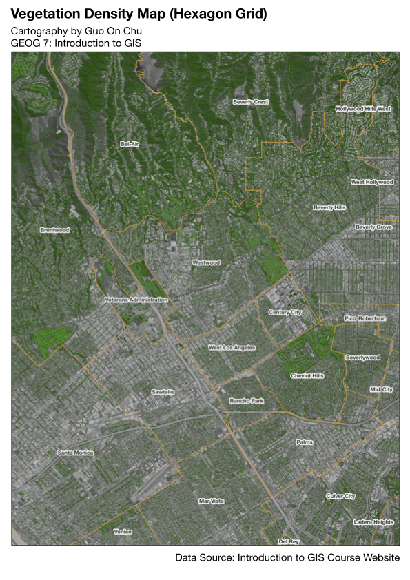
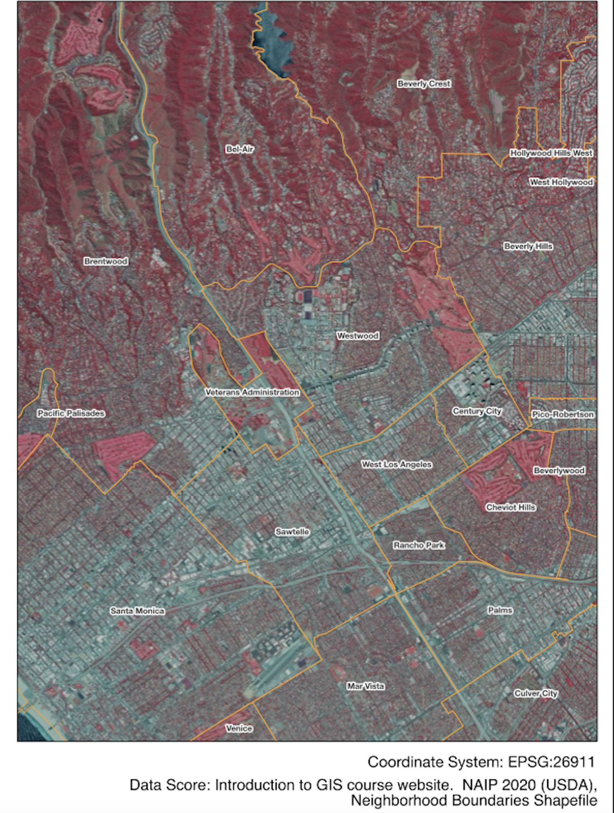

# Urban Environmental Risk Analysis using GIS & Remote Sensing
> A GIS-based project analyzing environmental risk and urban inequality in Los Angeles.
## Overview
This project analyzes environmental conditions in Los Angeles by integrating pollution data and vegetation patterns using GIS and remote sensing techniques.  
The goal is to understand how environmental risk and green space distribution vary across urban neighborhoods.

---

## Key Questions
- Are schools located near high-emission industrial facilities?
- Which areas have low vegetation coverage (urban heat / environmental risk)?
- Do pollution exposure and low vegetation overlap in certain regions?

---

## Data Sources
- Toxic Release Inventory (TRI) data (industrial emissions)
- School location data (K–12)
- Satellite imagery (NAIP 2020)
- GIS basemap and neighborhood boundaries

---

## Methods

### Spatial Analysis (GIS)
- Buffer analysis (1-mile radius around pollution sites)
- Spatial overlay between schools and emission sources
- Identification of high-risk zones

### Remote Sensing
- NDVI (Normalized Difference Vegetation Index) to measure vegetation density
- Color-Infrared (CIR) imagery to highlight vegetation
- Raster + vector data integration

---

## Results

### Pollution Risk
- Identified schools located within 1 mile of high-emission facilities
- High-risk regions include South Los Angeles, Carson, and Torrance

### Vegetation Patterns
- High vegetation density in areas such as Bel-Air and Brentwood
- Low vegetation coverage in dense urban areas (West LA, Mid-City)

### Key Insight
Areas with higher pollution exposure often coincide with lower vegetation coverage, suggesting environmental inequality across neighborhoods.

---

## Visualization

### Pollution & School Risk Map

### Vegetation Density (NDVI)

### Vegetation Highlight (CIR)

---

## Tools
- QGIS
- Remote Sensing (NDVI, CIR)
- Spatial Analysis (Buffer, Overlay)

---

## Project Output
- GIS maps visualizing environmental risk and vegetation distribution
- Spatial analysis report (see `/report` folder)

---

## Author
Guo On Chu  
Statistics & Data Science @ UCLA
